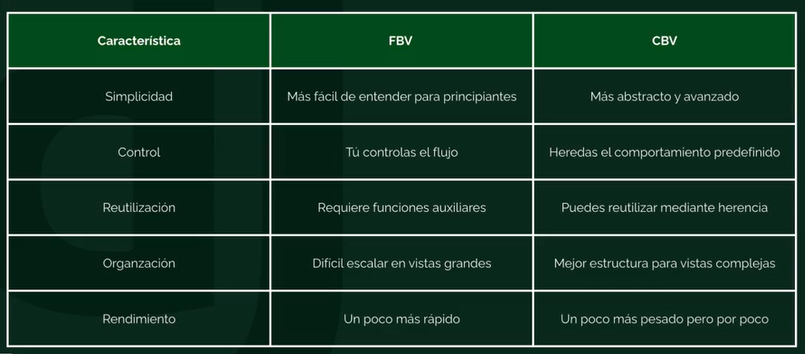

# Practice Views: FBV vs CBV en Django

> Proyecto didáctico para entender **qué es una vista en Django** y cuándo usar **Vistas Basadas en Funciones (FBV)** vs **Vistas Basadas en Clases (CBV)**. Incluye dos CRUDs reales: `products` (FBV) y `users` (CBV) + documentación (enfocada mayormente en **CBV**) en [`vbf-vbc/`](./vbf-vbc/).


---

## Tabla de contenido

- [¿Qué es una Vista?](#-qué-es-una-vista)
- [Estructura del proyecto](#-estructura-del-proyecto)
- [FBV vs CBV: Comparativa](#-fbv-vs-cbv--comparativa)
- [Ejemplos reales del proyecto](#-ejemplos-reales-del-proyecto)
  - [FBV:`apps/products`](#fbv--appsproducts-vistas-basadas-en-funciones)
  - [CBV:`apps/users`](#cbv--appsusers-vistas-basadas-en-clases)
- [CBV en profundidad (guía `vbf-vbc/`)](#-cbv-en-profundidad-guía-vbf-vbc)
- [Instalación y ejecución](#-instalación-y-ejecución)
- [Rutas principales](#-rutas-principales)
- [Estilos y navegación](#-estilos-y-navegación)
- [Recursos y documentación](#-recursos-y-documentación)

---

## ¿Qué es una Vista?

En Django, una **vista** es el **puente** entre la **petición HTTP** (`request`) y la **respuesta** (`response`). No es HTML ni es base de datos, es la **función o clase que decide qué hacer** con cada URL (consultar modelos, validar formularios, chequear permisos) y devolver un `HttpResponse` (HTML, JSON, redirect).

> Toda vista, sea **FBV** o **CBV**, hace exactamente lo mismo. Lo que cambia es **cómo organizas el código**.

### Esquema conceptual: El rol de una Vista en Django

```text
┌──────────────────┐             ┌──────────────────────────────────────────────┐             ┌────────────────────────┐
│ CLIENTE/BROWSER  │             │              FLUJO DE LA VISTA               │             │   RECURSOS / CAPAS     │
└────────┬─────────┘             └──────────────────────┬───────────────────────┘             └───────────┬────────────┘
         │                                              │                                                 │
         │  1. HTTP Request (Ej: GET / POST)            │                                                 │
         ├─────────────────────────────────────────────►│ [1] URLconf                                     │
         │                                              │     Mapea la URL a la vista asignada            │
         │                                              └───────────────┬───────────────┘                 │
         │                                                              │                                 │
         │                                                              ▼                                 │
         │                                              ┌───────────────────────────────┐                 │
         │                                              │ [2] VISTA (View)              │                 │
         │                                              │     Recibe el `HttpRequest`   │                 │
         │                                              └───────────────┬───────────────┘                 │
         │                                                              │                                 │
         │                                       ┌──────────────────────┴──────────────────────┐          │
         │                                       ▼                                             ▼          │
         │                             (Validar entrada / POST)                       (Consultar datos / GET)     │
         │                                ┌────────────┐                                ┌────────────┐    │
         │                                │ [3a] Form  │                                │ [3b] Modelo│───►│ Base de Datos (DB)
         │                                │ Validación │                                │ Capa ORM   │◄───┤ (QuerySets / SQL)
         │                                └─────┬──────┘                                └─────┬──────┘    │
         │                                      │                                             │           │
         │                                      └──────────────────────┬──────────────────────┘           │
         │                                                             │                                  │
         │                                                             ▼                                  │
         │                                              ┌───────────────────────────────┐                 │
         │                                              │ [4] Context & Template Engine ├────────────────►│ Plantillas HTML
         │                                              │     Combina datos con HTML    │◄────────────────┤ Archivo .html
         │                                              └───────────────┬───────────────┘                 │
         │                                                              │                                 │
         │                                                              ▼                                 │
         │                                              ┌───────────────────────────────┐                 │
         │                                              │ [5] Response                  │                 │
         │                                              │     Retorna el `HttpResponse` │                 │
         │                                              └───────────────┬───────────────┘                 │
         │  2. HTTP Response (HTML, JSON o Redirección)                 │                                 │
         ◄──────────────────────────────────────────────────────────────┘                                 │
```

### Anatomía paso a paso de una Vista

| # | Etapa | Qué hace la Vista en esta etapa |
|---|-------|---------------------------------|
| **1** | **URLconf (Enrutado)** | Recibe la petición HTTP del usuario (`HttpRequest`) y determina qué vista debe procesarla asociando la URL solicitada. |
| **2** | **Entrada a la Vista** | La vista (sea función `FBV` o clase `CBV`) se ejecuta. Recibe el objeto `request` con sus métodos (`GET`, `POST`, etc.), argumentos y parámetros. |
| **3** | **Procesamiento de Datos** | La vista ejecuta la lógica del negocio:<br>• **[3a] Formularios (`Form`):** Si recibe datos (POST), comprueba que sean válidos.<br>• **[3b] Modelos (`ORM`):** Consulta, guarda o actualiza información en la base de datos. |
| **4** | **Renderizado (`Template`)** | Empaqueta los datos procesados en un diccionario llamado **Contexto** (`context`) y se los entrega al motor de plantillas para rellenar la estructura HTML. |
| **5** | **Respuesta (`Response`)** | Concluye su ciclo empaquetando el resultado en un objeto `HttpResponse` (contenido HTML, JSON para APIs o una redirección HTTP) y lo envía de regreso al cliente. |

### ¿Dónde se diferencian FBV y CBV en el esquema?

```
URLconf ──► ¿FBV? ──►  Una función con todo el flujo a la vista:
                        def product_create(request):
                            if POST: form = ProductForm(request.POST)
                                    if valid: save(); redirect()
                            else: form = ProductForm()

        └─► ¿CBV? ──►  Una clase que delega a métodos:
                        class UserCreateView(CreateView):
                            model = User
                            form_class = UserForm
                            success_url = reverse_lazy("users:user_list")
                            # get() → muestra form
                            # post() → valida → form_valid() → save()
```

> **Regla de oro:** La vista no debe contener HTML a mano ni lógica de negocio pesada; delega a `models.py` (datos), `forms.py` (validación) y `templates/` (presentación). Así `products` y `users` hacen el mismo CRUD con dos estilos distintos.

---

## Estructura del proyecto

```
practice-views/
├── apps/
│   ├── core/            # Home / base
│   ├── products/        # CRUD con FBV  ← Vistas Basadas en Funciones
│   │   ├── models.py    # Product (slug, get_detail_url, etc.)
│   │   ├── forms.py     # ProductForm
│   │   ├── views.py     # product_list, product_detail, product_create...
│   │   ├── urls.py      # product-list, product-detail/<slug>, ...
│   │   └── templates/products/
│   └── users/           # CRUD con CBV  ← Vistas Basadas en Clases
│       ├── models.py    # User(AbstractUser) + slug
│       ├── forms.py     # UserForm
│       ├── views.py     # UserListView, UserDetailView, UserCreateView...
│       ├── urls.py      # user-list, user-detail/<slug> (.as_view())
│       └── templates/users/
├── static/css/          # CSS global (crud/list.css, base_crud.css, etc.)
├── templates/base.html  # Template base
├── practice_views/urls.py
├── vbf-vbc/             # Documentación profundizada CBV
│   ├── 01-comparativa/
│   ├── 02-View/ 03-TemplateView/ 04-ListView/ 05-DetailView/
│   ├── 06-CreateView/ 07-UpdateView/ 08-DeleteView/
│   └── README.md
└── manage.py
```

**Convención del proyecto:**

| App | Patrón | Enfoque | Paginación |
|-----|--------|---------|------------|
| `products` | **FBV** | Control explícito `if request.method == "POST"` | `Paginator` manual `settings.PAGE_NUMBER` |
| `users` | **CBV** | Genéricas `ListView`, `DetailView`, `CreateView`, `UpdateView`, `DeleteView` | `paginate_by = settings.PAGE_NUMBER` |

---

## FBV vs CBV: Comparativa

### Resumen rápido

| Aspecto | FBV | CBV |
|---------|-----|-----|
| **Definición** | `def mi_vista(request):` | `class MiVista(View):` + `as_view()` |
| **Legibilidad inicial** | Muy simple, lineal | Más abstracta al principio |
| **Reutilización** | Copiar/pegar o decoradores | Herencia, Mixins, `get_context_data()` |
| **Extensibilidad** | Crece en `if/else` si no se ordena | Fácil de extender sobrescribiendo métodos |
| **Métodos HTTP** | `if request.method == "POST"` manual | `def get()` / `def post()` separados; 405 automático |
| **Genéricas** | No, todo a mano | `ListView`, `DetailView`, `CreateView`... ahorran boilerplate |
| **Ideal para** | Lógica muy custom / prototypes | CRUDs, listados, formularios repetitivos |



Ver explicación breve en [`vbf-vbc/01-comparativa/README.md`](./vbf-vbc/01-comparativa/README.md).

#### Cuándo elegir cada una

**Elige FBV si:**
- Necesitas control total y flujo no estándar.
- La vista es corta y muy específica.
- Prefieres ver todo el flujo en una sola función.

**Elige CBV si:**
- Haces CRUD repetitivo (listar, ver, crear, editar, borrar).
- Quieres compartir comportamiento con `Mixins` (`LoginRequiredMixin`, `PermissionRequiredMixin`).
- Te beneficias de las genéricas que ya implementan paginación, `get_object()`, `form_valid()`, etc.

> **En este repo ambas conviven a propósito:** `products` demuestra FBV explícitas; `users` demuestra el mismo CRUD con CBV genéricas. Podés navegar libremente entre `/products/product-list/` ↔ `/users/user-list/` gracias a los botones cruzados del header.

---

## Ejemplos reales del proyecto

### FBV: `apps/products` (Vistas Basadas en Funciones)

> Todo el flujo es explícito: vos decidís qué pasa en GET y POST.

**`apps/products/views.py`**

```python
from django.shortcuts import render, get_object_or_404, redirect
from django.core.paginator import Paginator
from django.conf import settings
from apps.products.models import Product
from apps.products.forms import ProductForm

def product_list(request):
    products = Product.objects.all()
    paginator = Paginator(products, settings.PAGE_NUMBER)  # 3 por página
    page_number = request.GET.get("page", 1)
    products = paginator.page(page_number)
    return render(request, "products/crud/product_list.html", {"products": products})

def product_detail(request, slug):
    product = get_object_or_404(Product, slug=slug)
    return render(request, "products/product_detail.html", {"product": product})

def product_create(request):
    if request.method == "POST":
        form = ProductForm(request.POST, request.FILES)
        if form.is_valid():
            form.save()
            return redirect("products:product_list")
    else:
        form = ProductForm()
    return render(request, "products/crud/product_create.html", {"form": form})

def product_update(request, slug):
    product = get_object_or_404(Product, slug=slug)
    if request.method == "POST":
        form = ProductForm(request.POST, request.FILES, instance=product)
        if form.is_valid():
            form.save()
            return redirect("products:product_list")
    else:
        form = ProductForm(instance=product)
    return render(request, "products/crud/product_update.html", {"form": form, "object": product})

def product_delete(request, slug):
    product = get_object_or_404(Product, slug=slug)
    if request.method == "POST":
        product.delete()
        return redirect("products:product_list")
    return render(request, "products/crud/product_delete.html", {"product": product})
```

**`apps/products/urls.py`**

```python
from django.urls import path
from apps.products.views import product_list, product_detail, product_create, product_update, product_delete

app_name = "products"
urlpatterns = [
    path("product-list/", product_list, name="product_list"),
    path("product-create/", product_create, name="product_create"),
    path("product-detail/<slug:slug>/", product_detail, name="product_detail"),
    path("product-update/<slug:slug>/", product_update, name="product_update"),
    path("product-delete/<slug:slug>/", product_delete, name="product_delete"),
]
```

**Ventaja vista aquí:** Ves exactamente el `Paginator` manual, el `get_object_or_404` y el `if POST` → `is_valid()` → `save()`.

---

### CBV: `apps/users` (Vistas Basadas en Clases)

> Este CRUD, a diferencia del alterior, se delega el boilerplate a Django.

**`apps/users/views.py`**

```python
from django.views.generic import ListView, CreateView, UpdateView, DeleteView, DetailView
from django.urls import reverse_lazy
from django.conf import settings
from apps.users.models import User
from apps.users.forms import UserForm

class UserListView(ListView):
    model = User
    template_name = "users/crud/user_list.html"
    paginate_by = settings.PAGE_NUMBER      # ← paginación declarativa
    context_object_name = "users"

class UserDetailView(DetailView):
    model = User
    template_name = "users/user_detail.html"
    context_object_name = "user"

class UserCreateView(CreateView):
    model = User
    form_class = UserForm
    template_name = "users/crud/user_create.html"
    success_url = reverse_lazy("users:user_list")

class UserUpdateView(UpdateView):
    model = User
    form_class = UserForm
    template_name = "users/crud/user_update.html"

class UserDeleteView(DeleteView):
    model = User
    template_name = "users/crud/user_delete.html"
    success_url = reverse_lazy("users:user_list")
```

**`apps/users/urls.py`**

```python
from django.urls import path
from apps.users.views import UserListView, UserDetailView, UserCreateView, UserUpdateView, UserDeleteView

app_name = "users"
urlpatterns = [
    path("user-list/", UserListView.as_view(), name="user_list"),
    path("user-create/", UserCreateView.as_view(), name="user_create"),
    path("user-detail/<slug:slug>/", UserDetailView.as_view(), name="user_detail"),
    path("user-update/<slug:slug>/", UserUpdateView.as_view(), name="user_update"),
    path("user-delete/<slug:slug>/", UserDeleteView.as_view(), name="user_delete"),
]
```

**Ventaja vista aquí:** No escribís `Paginator`, ni `if POST`, ni `get_object_or_404`; `ListView` ya pagina, `DetailView` busca por `slug`, `CreateView/UpdateView` validan el `form_class` y `DeleteView` pide confirmación.

#### Tabla lado a lado

| Operación | FBV (`products`) | CBV (`users`) |
|-----------|------------------|---------------|
| **Listar** | `Paginator(products, 3)` manual | `paginate_by = 3` |
| **Detalle** | `get_object_or_404(Product, slug=slug)` | `DetailView` + `model = User` |
| **Crear** | `if POST: form.is_valid(): form.save()` | `CreateView` + `form_class` + `success_url` |
| **Editar** | `form = ProductForm(..., instance=product)` | `UpdateView` + `form_class` |
| **Eliminar** | `if POST: product.delete()` | `DeleteView` + `success_url` |

---

## CBV en profundidad (guía `vbf-vbc/`)

La carpeta [`vbf-vbc/`](./vbf-vbc/) es un mini-ebook que profundiza cada genérica. Cada subcarpeta tiene ejemplo + imagen demo.

| # | Vista | Qué resuelve | Archivo |
|---|-------|--------------|---------|
| 01 | **Comparativa** | FBV vs CBV pros/contras + imagen | [`01-comparativa/README.md`](./vbf-vbc/01-comparativa/README.md) |
| 02 | **View** | Clase base, control de `get()`/`post()`, 405 automático | [`02-View/README.md`](./vbf-vbc/02-View/README.md) |
| 03 | **TemplateView** | Renderizar HTML estático + `get_context_data()` | [`03-TemplateView/README.md`](./vbf-vbc/03-TemplateView/README.md) |
| 04 | **ListView** | `model.objects.all()` + `paginate_by` + `is_paginated` | [`04-ListView/README.md`](./vbf-vbc/04-ListView/README.md) |
| 05 | **DetailView** | Un objeto por `pk`/`slug` + `get_absolute_url()` | [`05-DetailView/README.md`](./vbf-vbc/05-DetailView/README.md) |
| 06 | **CreateView** | Crear con `ModelForm` + `form_valid()` para `author = request.user` | [`06-CreateView/README.md`](./vbf-vbc/06-CreateView/README.md) |
| 07 | **UpdateView** | Editar con slug dinámico + `get_queryset()` por permisos | [`07-UpdateView/README.md`](./vbf-vbc/07-UpdateView/README.md) |
| 08 | **DeleteView** | Confirmación + `success_url = reverse_lazy(...)` | [`08-DeleteView/README.md`](./vbf-vbc/08-DeleteView/README.md) |

**Jerarquía de herencia:**

```
View
 └─ TemplateView      → solo template + contexto
     └─ ListView      → lista + paginación
     └─ DetailView    → un objeto
         └─ CreateView → form + save()
         └─ UpdateView → form + instance
         └─ DeleteView → confirm + delete()
```

**Tip clave de `TemplateView` directa en `urls.py`:**

```python
path('acerca-de/', TemplateView.as_view(template_name="acerca_de.html"), name='acerca')
```

**Tip de contexto compartido:**

```python
class BaseView(TemplateView):
    def get_context_data(self, **kwargs):
        context = super().get_context_data(**kwargs)
        context["categorias"] = Categoria.objects.all()
        return context
```

---

## Instalación y ejecución

**Requisitos:** Python 3.11+, `uv` o `pip`

```bash
# 1. Clonar y entrar
git clone https://github.com/wgarcia-dev/crud-django-fbv-cbv.git
cd practice-views

# ---------

# 2. Crear el entorno 
uv init
uv venv

# alternatia con pip
py -m venv venv

# --------

# 3. Activar el entorno
.venv\Scripts\activate   # o venv\Scripts\activate

# 4. Migraciones y superuser
py manage.py migrate

# 5. Correr
py manage.py runserver
# http://127.0.0.1:8000/
# http://127.0.0.1:8000/products/product-list/  (FBV)
# http://127.0.0.1:8000/users/user-list/        (CBV)
```

**Variables relevantes (`practice_views/settings.py`):**

```python
PAGE_NUMBER = 3
AUTH_USER_MODEL = "users.User"
STATIC_URL = 'static/'
MEDIA_URL = 'media/'
```

---

## Rutas principales

| URL | Vista | Tipo |
|-----|-------|------|
| `/` | `core` home | `TemplateView` |
| `/products/product-list/` | `product_list` | FBV |
| `/products/product-create/` | `product_create` | FBV |
| `/products/product-detail/<slug>/` | `product_detail` | FBV |
| `/products/product-update/<slug>/` | `product_update` | FBV |
| `/products/product-delete/<slug>/` | `product_delete` | FBV |
| `/users/user-list/` | `UserListView` | CBV |
| `/users/user-create/` | `UserCreateView` | CBV |
| `/users/user-detail/<slug>/` | `UserDetailView` | CBV |
| `/users/user-update/<slug>/` | `UserUpdateView` | CBV |
| `/users/user-delete/<slug>/` | `UserDeleteView` | CBV |

Navegación cruzada incluida en los headers de `product_list.html` y `user_list.html` (botones `Ver Usuarios` ↔ `Ver Productos`).

---

## Estilos y navegación

- CSS global en `static/css/base.css` (variables `--primary`, `--secondary`...) y `static/css/crud/` (`list.css`, `base_crud.css`, `delete.css`, `detail.css`).
- Paginador en `static/css/includes/paginator.css`.
- Tablas con `crud-table` + `actions` wrapper para evitar `display:flex` en `td`.

---

## Recursos y documentación

- **Guía local:** [`vbf-vbc/README.md`](./vbf-vbc/README.md) (ebook base).
- **Docs oficiales Django:** https://docs.djangoproject.com/en/5.2/topics/class-based-views/
- **Genéricas:** https://docs.djangoproject.com/en/5.2/ref/class-based-views/generic-display/ y `generic-editing/`
