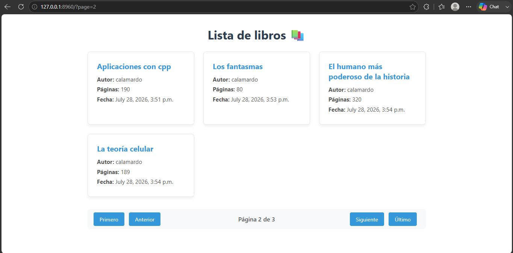

# Concepto inicial 

- Lista objetos de un modelo 
- Internamente, realiza una consulta **.all()** y pasa los resultados a la plantilla mediante el contexto 

# Ejemplo 

```python
# views.py
from django.shortcuts import render
from django.views.generic import ListView 
from .models import Book 

class BookListView(ListView): 
    model = Book
    template_name = "book/book_list.html"
    paginate_by = 4
    context_object_name = "books"

# urls.py
app_name = "book"

urlpatterns = [
    path("", BookListView.as_view(), name="home")
]
```

```html



Lista de libros 📚


    <link rel="stylesheet" href="">



    <div class="books-container-main">
        <h2 class="title">Lista de libros 📚</h2>

        <div class="books-grid">
            
                <div class="book-card">
                    <h3 class="book-title">{{ book.title }}</h3>
                    <p class="books-field"><strong>Autor:</strong> {{ book.author.username }}</p>
                    <p class="books-field"><strong>Páginas:</strong> {{ book.pages }}</p>
                    <p class="books-field"><strong>Fecha:</strong> {{ book.created_at }}</p>
                </div>
            
                <p class="empty-message">No hay libros disponibles por el momento...</p>
            
        </div>
        
         Sirve para indicar si hay paginación 
        
            <div class="container-paginator">
                <div class="paginator-group">
                    
                        <a class="paginator-btn" href="?page=1">Primero</a>
                        <a class="paginator-btn" href="?page={{ page_obj.previous_page_number }}">Anterior</a>
                    
                </div>

                <span class="paginator-info">Página {{ page_obj.number }} de {{ page_obj.paginator.num_pages }}</span>

                <div class="paginator-group">
                    
                        <a class="paginator-btn" href="?page={{ page_obj.next_page_number }}">Siguiente</a>
                        <a class="paginator-btn" href="?page={{ page_obj.paginator.num_pages }}">Último</a>
                    
                </div>
            </div>
        
    </div>

```

