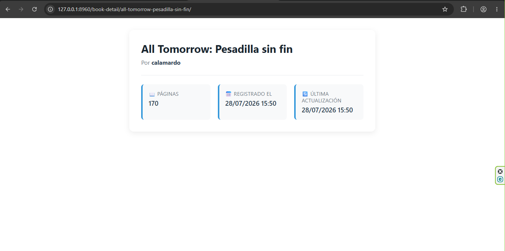

# Concepto inicial 

- Muestra los detalles de un solo registro
- Se basa en una _llave primaria_ o _slug_
- Usa una plantilla **model_detail** pero se puede cambiar

# Ejemplo 

```python
# views.py
class BookDetailView(DetailView): 
    model = Book
    template_name = "book/book_detail.html"
    context_object_name = "book"

# Para implementar el detalle de cada libro, modificamos models.py
# models.py
from django.db import models
from django.conf import settings
from django.urls import reverse

class Book(models.Model): 
    author = models.ForeignKey(
        settings.AUTH_USER_MODEL, 
        models.CASCADE, 
        related_name="books"
    )
    title = models.CharField(max_length=150)
    slug = models.SlugField(max_length=165)
    pages = models.PositiveIntegerField()
    created_at = models.DateTimeField(auto_now_add=True)
    updated_at = models.DateTimeField(auto_now=True)

    # Lo más importante!
    def get_absolute_url(self):
        return reverse(
            "book:book_detail", 
            kwargs={"slug": self.slug}
        )

# urls.py
app_name = "book"

urlpatterns = [
    ..., 
    path("book-detail/<slug:slug>/", BookDetailView.as_view(), name="book_detail")
]
```

```html
 Para crear los links a cada uno de los detalles, modificalos el for de book_list.html 


    <div class="book-card">
         Aquí exactamente 
        <h3 class="book-title">
            <a href="{{ book.get_absolute_url }}">{{ book.title }}</a>
        </h3>
        <p class="books-field"><strong>Autor:</strong> {{ book.author.username }}</p>
        <p class="books-field"><strong>Páginas:</strong> {{ book.pages }}</p>
        <p class="books-field"><strong>Fecha:</strong> {{ book.created_at }}</p>
    </div>

    <p class="empty-message">No hay libros disponibles por el momento...</p>

```

