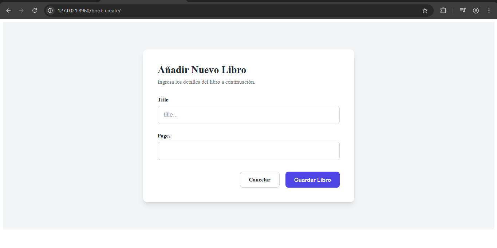

# Concepto inicial 

- Crea registros en la base de datos 
- La creación de registros se lleva a cabo de manera simple y eficiente
- Para el uso de esta VBC, necesitamos crear un _formulario_

# Ejemplo

```python
from django.db import models
from django.conf import settings
from django.urls import reverse
from django.utils.text import slugify

class Book(models.Model): 
    author = models.ForeignKey(
        settings.AUTH_USER_MODEL, 
        models.CASCADE, 
        related_name="books"
    )
    title = models.CharField(max_length=150)
    slug = models.SlugField(max_length=165, unique=True, blank=True)
    pages = models.PositiveIntegerField()
    created_at = models.DateTimeField(auto_now_add=True)
    updated_at = models.DateTimeField(auto_now=True)

    # Este cambio es sustancial
    def save(self, *args, **kwargs): 
        if not self.slug: 
            self.slug = slugify(self.title)
        
        super().save(*args, **kwargs)

    def get_absolute_url(self):
        return reverse(
            "book:book_detail", 
            kwargs={"slug": self.slug}
        )
```

```python
# forms.py
from django import forms 
from .models import Book 

class BookForm(forms.ModelForm): 
    class Meta: 
        model = Book 
        fields = ["title", "pages"]
        widgets = {
            "author": forms.TextInput(attrs={
                "placeholder": "Author...", 
                "class": "input-form input-text"
            }),
            "title": forms.TextInput(attrs={
                "placeholder": "title...", 
                "class": "input-form input-text"
            }),
            "pages": forms.NumberInput(attrs={
                "min": "1", 
                "class": "input-form input-number"
            }) 
        }
```

```python
# views.py
class BookCreateView(CreateView): 
    model = Book 
    form_class = BookForm
    template_name = "book/book_create.html"

    def form_valid(self, form): 
        form.instance.author = self.request.user
        return super().form_valid(form)

# urls.py
app_name = "book"

urlpatterns = [
    ..., 
    path("book-detail/<slug:slug>/", BookDetailView.as_view(), name="book_detail"), 
    path("book-create/", BookCreateView.as_view(), name="book_create")
]
```

```html
 Importante lo siguiente en book_list.html 
<a href="" class="btn-create">Crear libro</a>

Contenido de book_create.html



Crear un libro


    <link rel="stylesheet" href="">



    <div class="form-wrapper">
        <div class="form-card">
            <h2 class="form-title">Añadir Nuevo Libro</h2>
            <p class="form-subtitle">Ingresa los detalles del libro a continuación.</p>

            <form method="post" class="book-form">
                

                
                    <div class="alert alert-error">
                        {{ form.non_field_errors }}
                    </div>
                

                
                    <div class="form-group">
                        <label for="{{ field.id_for_label }}" class="form-label">
                            {{ field.label }}
                        </label>
                        
                        {{ field }}
                        
                        
                            <div class="field-error">
                                
                                    <span>{{ error }}</span>
                                
                            </div>
                        
                    </div>
                

                <div class="form-actions">
                    <a href="" class="btn btn-secondary">Cancelar</a>
                    <button type="submit" class="btn btn-primary">Guardar Libro</button>
                </div>
            </form>
        </div>
    </div>

```

