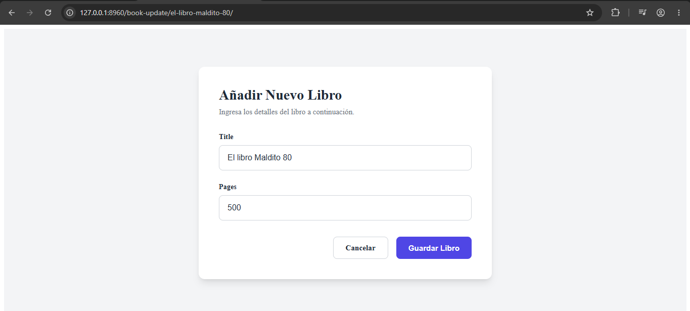

# Concepto principal

En resumidas cuentas, sirve para editar los registros _existentes_ de un determinado modelo

# Ejemplo 

```python
# models.py
# Nuevo cambio!
class Book(models.Model): 
    ...

    def save(self, *args, **kwargs):
        # Determinamos si el título cambió o si es un nuevo registro sin slug
        if not self.pk or (self.pk and Book.objects.get(pk=self.pk).title != self.title):
            base_slug = slugify(self.title)
            slug = base_slug
            counter = 1
            
            # Si existe otro libro con el mismo slug (excluyendo este mismo objeto), agregamos un contador
            while Book.objects.filter(slug=slug).exclude(pk=self.pk).exists():
                slug = f"{base_slug}-{counter}"
                counter += 1
                
            self.slug = slug

        super().save(*args, **kwargs)

    def get_absolute_url(self):
        return reverse(
            "book:book_detail", 
            kwargs={"slug": self.slug}
        )

    def get_update_url(self): 
        return reverse(
            "book:book_update", 
            kwargs={"slug": self.slug}
        )
```

```python
# views.py
class BookUpdateView(UpdateView): 
    model = Book 
    form_class = BookForm
    template_name = "book/book_create.html"

    # Evita que otros manipulen libros que no son suyos
    def get_queryset(self):
        return Book.objects.filter(author=self.request.user)

# urls.py
app_name = "book"

urlpatterns = [
    ...,
    path("book-update/<slug:slug>/", BookUpdateView.as_view(), name="book_update")
]
```

```html
Cambios en book_create.html
<div class="books-grid">
    
        <div class="book-card">
            <h3 class="book-title">
                <a href="{{ book.get_absolute_url }}">{{ book.title }}</a>
            </h3>
            <p class="books-field"><strong>Autor:</strong> {{ book.author.username }}</p>
            <p class="books-field"><strong>Páginas:</strong> {{ book.pages }}</p>
            <p class="books-field"><strong>Fecha:</strong> {{ book.created_at }}</p>
            <!-- Solo muestra el botón si el usuario logueado es el autor -->
            
                <p><a href="{{ book.get_update_url }}">Modificar</a></p>
            
        </div>
    
        <p class="empty-message">No hay libros disponibles por el momento...</p>
    
</div>
```

