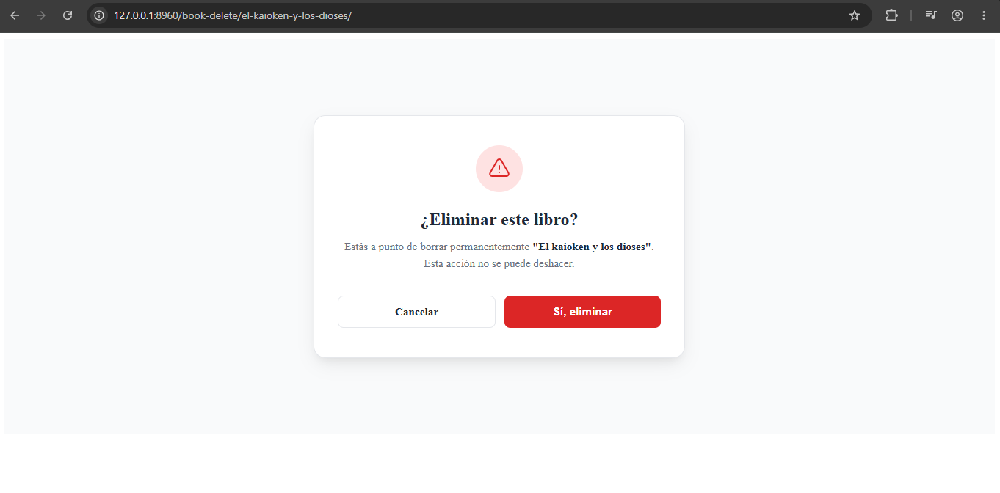

# Concepto general

Permite eliminar registros con respecto a un determinado modelo 

# Ejemplos 

```python
# models.py
# modificaciones

from django.db import models
from django.conf import settings
from django.urls import reverse

class Book(models.Model): 
    ...

    def get_delete_url(self): 
        return reverse(
            "book:book_delete",
            kwargs={"slug": self.slug}
        )
```

```python
# views.py
class BookDeleteView(DeleteView): 
    model = Book
    template_name = "book/book_delete.html"
    success_url = reverse_lazy("book:home")

    def get_queryset(self):
        return Book.objects.filter(author=self.request.user)

# urls.py
app_name = "book"

urlpatterns = [
    ..., 
    path("book-delete/<slug:slug>/", BookDeleteView.as_view(), name="book_delete")
]
```

```html
Nueva modificacion en book_list.html
<!-- Solo muestra el botón si el usuario logueado es el autor -->

    <p><a href="{{ book.get_update_url }}">Modificar</a></p>



    <p><a href="{{ book.get_delete_url }}">Eliminar</a></p>


Contenido de book_delete.html



Eliminar libro


    <link rel="stylesheet" href="">



    <div class="delete-wrapper">
        <div class="delete-card">
            <div class="delete-icon-container">
                <svg class="delete-icon" xmlns="http://www.w3.org/2000/svg" fill="none" viewBox="0 0 24 24" stroke-width="1.5" stroke="currentColor">
                    <path stroke-linecap="round" stroke-linejoin="round" d="M12 9v3.75m-9.303 3.376c-.866 1.5.217 3.374 1.948 3.374h14.71c1.73 0 2.813-1.874 1.948-3.374L13.949 3.378c-.866-1.5-3.032-1.5-3.898 0L2.697 16.126zM12 15.75h.007v.008H12v-.008z" />
                </svg>
            </div>

            <h2 class="delete-title">¿Eliminar este libro?</h2>
            <p class="delete-message">
                Estás a punto de borrar permanentemente <strong>"{{ object.title }}"</strong>. Esta acción no se puede deshacer.
            </p>

            <form method="post" class="delete-form">
                
                
                <div class="delete-actions">
                    <a href="{{ object.get_absolute_url }}" class="btn btn-secondary">Cancelar</a>
                    <button type="submit" class="btn btn-danger">Sí, eliminar</button>
                </div>
            </form>
        </div>
    </div>

```

